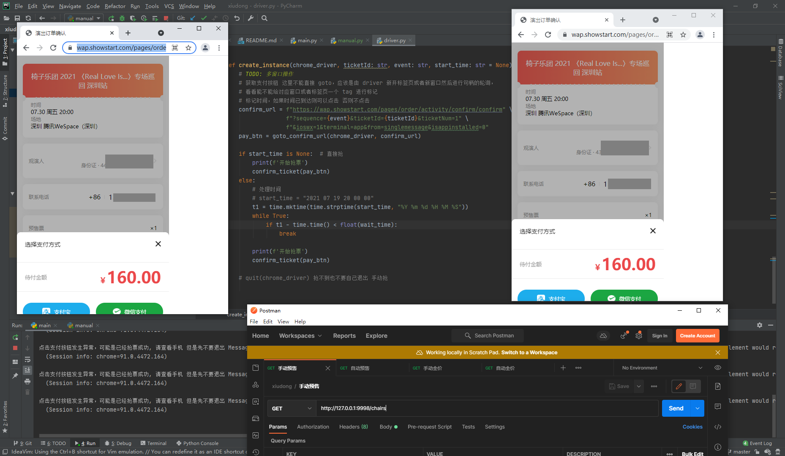

### xiudong-selenium

> 此版本为 selenium 模拟浏览器操作 目前考虑随缘维护。

试试能不能抢到椅子乐团演出票

github repo: https://github.com/ronething/xiudong-selenium 防止一部分爬虫乱转载。

#### usage

chromedriver 程序需要下载一下

https://chromedriver.chromium.org/downloads

```
git clone https://github.com/ronething/xiudong-selenium.git
pip3 install -r req.txt
python3 main.py
```

提供了两个 api

- 一个是跳转到登录页面，请自行登录 `/login`
- 一个是通用购买演出票 api，请自行传入对应参数, 支持定时功能 `/buy?event=xxx&ticketId=xxx&cron_time=xxx`
- 支持自动选择观演人 

`need_select` 如果不传，则不会选择观演人，如果传了，则会获取 `select_num` 的值进行观演人数量的选择, 具体逻辑参见代码
 
```sh
$ curl "http://127.0.0.1:9997/buy?event=169893&ticketId=xxx&need_select=True&ticketNum=1&select_num=1"
```

- 现可通过 [xiudong-go](https://github.com/ronething/xiudong-go) 进行 ticketId 的获取
- 如果多次刷新 login 且登录页面没有进行登录，可能会存在线程阻塞问题，因为 max_workers 设置了 10 个, 暂时可以通过关闭窗口解决
- 如果确认订单页面显示已售罄，需要不断刷新直到出现立即支付，这一点在捡漏的时候很有用
- 只是给大家提供点思路，其他请自行阅读代码，祝大家好运
- **注意：** 有问题请先看 [issue](https://github.com/ronething/xiudong-selenium/issues?q=is%3Aissue), 没有则新开 issue 提问即可

### 成功截图

昨晚抢到了。不错。



### 免责声明

本仓库发布的 `xiudong-selenium` 项目中涉及的任何脚本，仅用于测试和学习研究，禁止用于商业用途，不能保证其合法性，准确性，完整性和有效性，请根据情况自行判断。

本项目内所有资源文件，禁止任何公众号、自媒体进行任何形式的转载、发布。

本人对任何脚本问题概不负责，包括但不限于由任何脚本错误导致的任何损失或损害.

间接使用脚本的任何用户，包括但不限于建立VPS或在某些行为违反国家/地区法律或相关法规的情况下进行传播, 本人 对于由此引起的任何隐私泄漏或其他后果概不负责。

请勿将 `xiudong-selenium` 项目的任何内容用于商业或非法目的，否则后果自负。

如果任何单位或个人认为该项目的脚本可能涉嫌侵犯其权利，则应及时通知并提供身份证明，所有权证明，我们将在收到认证文件后删除相关脚本。

以任何方式查看此项目的人或直接或间接使用 `xiudong-selenium` 项目的任何脚本的使用者都应仔细阅读此声明。本人 保留随时更改或补充此免责声明的权利。
一旦使用并复制了任何相关脚本或 `xiudong-selenium` 项目，则视为您已接受此免责声明。

您必须在下载后的24小时内从计算机或手机中完全删除以上内容。

本项目遵循 `GPL-3.0 License` 协议，如果本特别声明与 `GPL-3.0 License` 协议有冲突之处，以本特别声明为准。

> 您使用或者复制了本仓库且本人制作的任何代码或项目，则视为已接受此声明，请仔细阅读
您在本声明未发出之时点使用或者复制了本仓库且本人制作的任何代码或项目且此时还在使用，则视为已接受此声明，请仔细阅读

### change log

- 2022/06/18 支持自动选择观演人

### Star History


### acknowledgement

- https://selenium-python.readthedocs.io/getting-started.html -> 模拟浏览器操作
- https://flask.palletsprojects.com/en/2.0.x -> web 框架
- https://github.com/yangn0/Xiudong-Script -> 提供了思路
